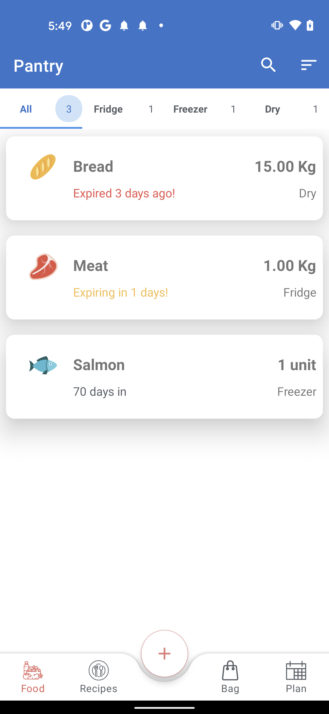
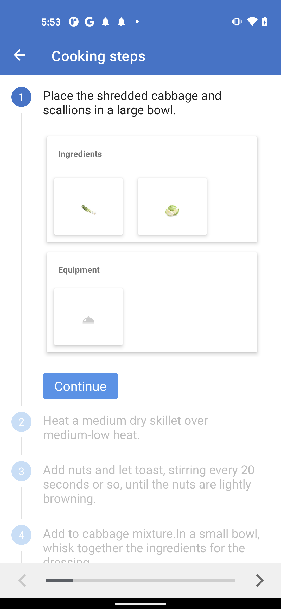

# SaveTheFood (Under development)
App for keeping trace of food in the fridge and for searching recipes based either on general filters or on saved foods.
I've build one activity app with some navigation levels. I worked with Jetpack components like Room, Databinding, Livedata, Nagivation, Viewmodel, Workmanager. The pattern used is the MVVM.
IMPORTANT: Create a free api key here and change it in file ApiKey ----> https://spoonacular.com/food-api

UNDER DEVELOPMENT: Porting of the business logic into the shared KMM module. Steps:
1 - Migrate room to sqldelight (DONE)

2 - Migrate Retrofit to KTOR (DONE)

3 - Migrate Business local datasource (DONE)

4 - Migrate Business local remotesource (DONE)

5 - Migrate data classes (DONE)

6 - Migrate Repository (DONE)

7 - Add testing modules (UNDER DEV)

8 - add Jetpack compose https://developer.android.com/jetpack/compose (UNDER DEV)

8.1 Use example animation codelab https://developer.android.com/codelabs/jetpack-compose-animation
    but not using borders. We can add a baseline to the bottom of the tab with a similar left-right animation
    
9 - Migrate VMs

10- Create one single VM for both ios and android (we probably need to use the StateFlow and SharedFlow)

Main branches

1 - Master          -> Current dev with compose

2 - finalbeforekmm  -> Project without shared module (Hilt, Retrofit, Room)

3 - sharedmodulekmm -> Project with KMM shared module (Koin, KTOR, SQLDelight)

Login                                                |  Sign up                                             |  Home
:---------------------------------------------------:|:----------------------------------------------------:|:-------------------------------------------------------:
||

Food Detail                                               |  Add Food                                            |  Search
:--------------------------------------------------------:|:----------------------------------------------------:|:-------------------------------------------------------:
||

Food Found                                                |  Recipes.                                            |  Recipe detail
:--------------------------------------------------------:|:----------------------------------------------------:|:-------------------------------------------------------:
||

Cook                                                |
:--------------------------------------------------------:|
.    |

#######################
#       Compose
#######################

Login                                                     |  Recipes.                                                     | 
:--------------------------------------------------------:|:-------------------------------------------------------------:|
||

