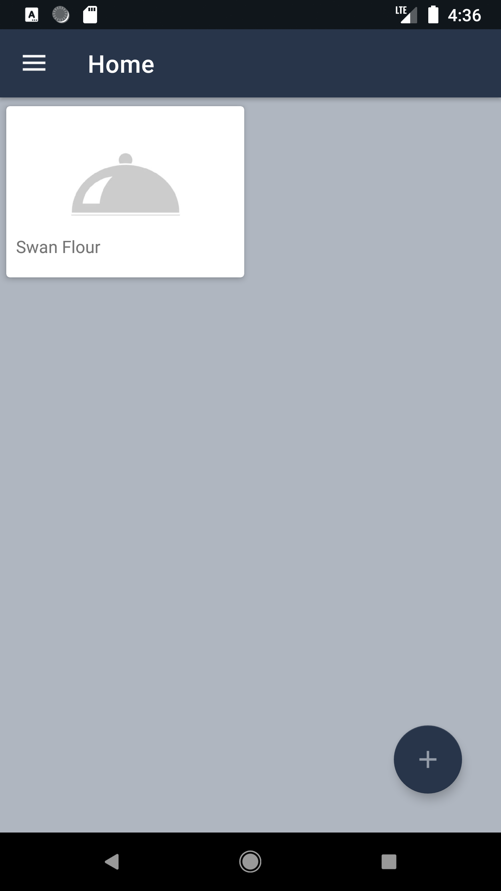

# SaveTheFood (Under development)
App for keeping trace of food in the fridge and for searching recipes based either on general filters or on saved foods.
I've build one activity app with some navigation levels. I worked with Jetpack components like Room, Databinding, Livedata, Nagivation, Viewmodel, Workmanager. The pattern used is the MVVM.

